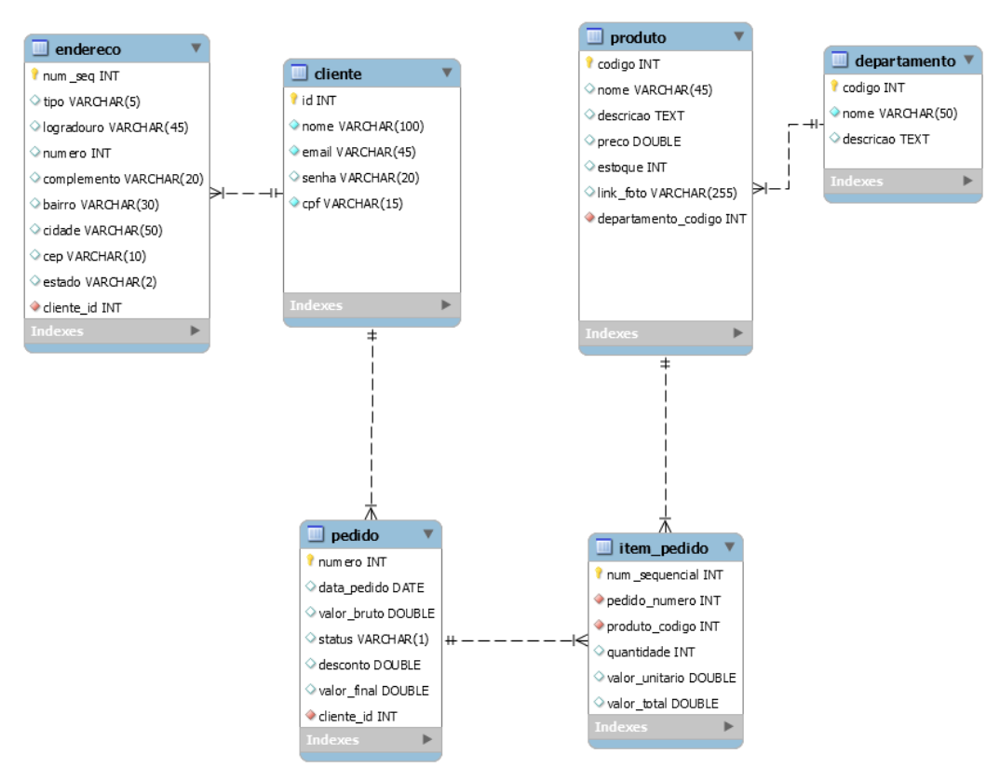

# Exercícios mySQl - #XP40 Gama Academy

  
   

---

 ## ☕ Sobre
  Durante a semana 10 do [#XP Gama Academy](https://www.gama.academy/?utm_source=google&utm_medium=compramidia&utm_campaign=institucional-brand&gclid=Cj0KCQiAr5iQBhCsARIsAPcwROO3WtlUchxESKbBrOdl4jbjenx39AvK5B465sMh3Q6VHgUaPDj0RwcaAirOEALw_wcB), tivemos contato e aulas de SQl (mySQl).
  Os exercícios a seguir foram propostos através de um desafio (com prazo de entrega) com o objetivo de fixar e praticar o uso de Banco de Dados.

  ## ☕ Criação de Tabelas
  Para a resolução do exercicio, foram criadas as seguintes tabelas:

  
   

## 💻 Exercícios Propostos:

1 - Este exercício é livre para você inserir dados nas tabelas. Adicione vários dados em todas as tabelas. Crie vários clientes, com vários endereços. Insira muitos produtos em vários departamentos. Crie pedidos em várias datas com meses diferentes (serão necessários para os próximos exercícios).

2 - Quantos clientes estão cadastrados na sua base?

3 - Qual o produto mais caro?

4 - Qual o produto mais barato?

5 - Mostre todos os produtos com seus respectivos departamentos.

6 - Quantos produtos há em cada departamento? Exiba o nome do departamento e a quantidade de produtos que há em cada um. (pense em SUM e GROUP BY)

7 - Mostre os dados dos pedidos, incluindo nomes dos clientes e nomes dos produtos que foram vendidos.

8 - Mostre quantos pedidos foram feitos por mês no ano de 2022 (caso você tenha registros neste ano, senão escolha um ano que você tenha cadastrado - Novamente pense em COUNT e GROUP BY).

9 - Mostre quanto foi faturado por mês (leve em conta o valor total de cada pedido - novamente pense em GROUP BY e SUM).

10 - Mostre o valor total do estoque por departamento.

## 🤝 Colaboradores

<table>
  <tr>
    <td align="center">
      <a href="https://github.com/Marcos-Ignacio">
         
        
          <b>Marcos Ignacio</b>
        
      </a>
    </td>
    <td align="center">
      <a href="https://github.com/wspietro">
         
        
          <b>Pietro Sera</b>
        
      </a>
    </td>
     <td align="center">
      <a href="https://github.com/thewillian">
         
        
          <b>Willian Monteiro</b>
        
      </a>
    </td>
  </tr>
</table>

 
 